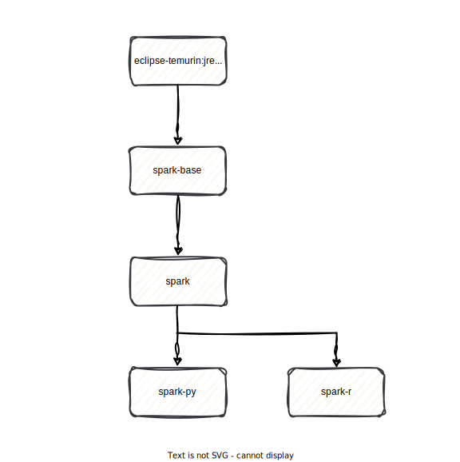

[](https://github.com/OKDP/spark-images/actions/workflows/ci.yml)
[](https://github.com/OKDP/spark-images/actions/workflows/release-please.yml)
[](https://github.com/OKDP/spark-images/releases/latest)
[](https://spark.apache.org/)
[](http://www.apache.org/licenses/LICENSE-2.0)

# OKDP Spark Images

Apache Spark Docker images built from the official Spark distribution, with automatic dependency bumps and a small set of runtime jars baked in.

## Why this project

The upstream Apache Spark Docker images target a limited matrix and ship Spark as-is. OKDP rebuilds Spark from source with:

- **Wider supported matrix**: Spark 3.2, 3.3, 3.4, 3.5 combined with Scala 2.12/2.13, Java 11/17 and Hadoop 3.3.6.
- **Automatic security bumps**: Maven properties (Log4j, Jackson, Netty, Guava, AWS SDK, Jetty, …) are bumped to fixed versions at build time, declared in `spark-base/spark-X.Y/pombump-properties.yaml`.
- **Selected source patches** for known Spark CVEs, declared in `.build/pre-build-patch-pombump.yml`.
- **Bundled runtime jars** in the `spark` image: Apache Iceberg runtime + Iceberg AWS bundle, `okdp-spark-auth-filter` (OIDC on the Spark UI), Prometheus JMX javaagent. Full list in `.build/ci-versions.yml`.
- **Weekly rebuild** of the latest release tag to ship the most recent OS security updates.
- **Cosign-signed** images.

## What the project does

This repository builds and publishes four Apache Spark container images to `quay.io/okdp`:

- A base image (`spark-base`) built from the upstream Apache Spark source tree, with pombump applied and the Kubernetes / Hadoop-cloud profiles enabled.
- A runtime image (`spark`) that adds the OKDP runtime jars (Iceberg, OIDC auth filter, JMX javaagent) on top of `spark-base`.
- Two language-specific images (`spark-py`, `spark-r`) that extend `spark` with Python or R support.

All four are produced by the matrix defined in [`.build/ci-versions.yml`](.build/ci-versions.yml).

## Components

| Image          | Description                                                                                                                                                       |
|:---------------|:------------------------------------------------------------------------------------------------------------------------------------------------------------------|
| `JRE`          | Upstream `eclipse-temurin:<JAVA_VERSION>-jre-jammy` base image. Java 11 or 17 depending on the Spark line (see [`.build/reference-versions.yml`](.build/reference-versions.yml)). |
| `spark-base`   | Apache Spark distribution built from source, **without** OKDP runtime jars.                                                                                       |
| `spark`        | `spark-base` + OKDP runtime jars (Iceberg, OIDC auth filter, JMX javaagent).                                                                                       |
| `spark-py`     | `spark` + Python support (default `python3.11`).                                                                                                                   |
| `spark-r`      | `spark` + R support (R from the Ubuntu base `r-base` package).                                                                                                     |

## Architecture

The four image variants form a strict inheritance chain. `spark-base` provides the Spark distribution; `spark` layers the OKDP runtime jars; `spark-py` and `spark-r` extend `spark` with language runtimes. See the upstream [Apache Spark cluster overview](https://spark.apache.org/docs/latest/cluster-overview.html) for how a Spark application uses these images at runtime.

<p align="center">
 
</p>

## Prerequisites

- [Docker](https://www.docker.com/) with multi-stage build support.
- Enough free disk for the image (the published `spark` image is ~3.5 GB).

The validated Spark × Scala × Java × Hadoop × Python combinations are declared in [`.build/ci-versions.yml`](.build/ci-versions.yml). Anything in that file is tested on every PR; combinations outside that file are not guaranteed to build.

### Toolchain tested

The Quick Start was verified end-to-end on the following environment:

| Tool   | Version       |
|:-------|:--------------|
| Docker | `28.2.2`      |
| OS     | `darwin/arm64` |

## Quick Start

Pull a recent OKDP Spark image:

```sh
docker pull quay.io/okdp/spark:spark-3.5.6-scala-2.13-java-17
```

Run a `SparkPi` job in local mode to verify everything works. The `grep` filter at the end skips the verbose Spark INFO log lines and keeps only the result:

```sh
docker run --rm quay.io/okdp/spark:spark-3.5.6-scala-2.13-java-17 \
  /opt/spark/bin/spark-submit \
  --class org.apache.spark.examples.SparkPi \
  --master 'local[2]' \
  /opt/spark/examples/jars/spark-examples_2.13-3.5.6.jar 100 \
  2>&1 | grep "Pi is roughly"
```

Expected output:

```
Pi is roughly 3.14...
```

Container exits with code `0`. End-to-end run ~12 s on a recent laptop. To see the full Spark logs, drop the `2>&1 | grep "Pi is roughly"` suffix.

## Installation

The images are usable in three modes; pick the one matching your deployment.

### Local mode

Equivalent to the Quick Start above. `docker run` + `spark-submit --master 'local[N]'`.

### Kubernetes mode

The image entrypoint ([`spark-base/entrypoint.sh`](spark-base/entrypoint.sh)) implements the `driver` / `executor` commands used by `spark-submit --master k8s://…`. From a host with `kubectl` configured against your cluster:

```sh
# Replace K8S_API_SERVER and YOUR_MAIN_CLASS with your own values;
# YOUR_JAR is the path to your application jar inside the image.
spark-submit \
  --master k8s://https://K8S_API_SERVER \
  --deploy-mode cluster \
  --conf spark.kubernetes.container.image=quay.io/okdp/spark-py:spark-3.5.6-python-3.11-scala-2.13-java-17 \
  --class YOUR_MAIN_CLASS \
  local:///path/to/YOUR_JAR.jar
```

### Pass-through mode

When the first argument is neither `driver` nor `executor`, the entrypoint `exec`s the command verbatim (see [`spark-base/entrypoint.sh`](spark-base/entrypoint.sh)). Useful for `spark-shell`, `pyspark`, debugging:

```sh
docker run --rm -it quay.io/okdp/spark:spark-3.5.6-scala-2.13-java-17 /opt/spark/bin/spark-shell
```

## Cleanup

Remove a single pulled image:

```sh
docker rmi quay.io/okdp/spark:spark-3.5.6-scala-2.13-java-17
```

Free all dangling images and stopped containers from local re-builds:

```sh
docker system prune
```

## Configuration

The image build behaviour is controlled by a small set of build arguments. The full default list lives in the Dockerfiles ([`spark-base`](spark-base/Dockerfile), [`spark`](spark/Dockerfile), [`spark-py`](spark-py/Dockerfile), [`spark-r`](spark-r/Dockerfile)); the CI matrix overrides them per combination in [`.build/ci-versions.yml`](.build/ci-versions.yml).

The most useful ones for downstream consumers:

- **`SPARK_PACKAGES`** ([`spark/Dockerfile`](spark/Dockerfile)) — comma-separated list of Maven coordinates or jar URLs baked into the `spark` image. Default ships Iceberg + `okdp-spark-auth-filter` + Prometheus JMX javaagent. Override to add or replace jars.
- **`BASE_IMAGE`** ([`spark/Dockerfile`](spark/Dockerfile), [`spark-py/Dockerfile`](spark-py/Dockerfile), [`spark-r/Dockerfile`](spark-r/Dockerfile)) — override the parent image for local re-builds.
- **`PYTHON_VERSION`** ([`spark-py/Dockerfile`](spark-py/Dockerfile), default `3.11`) — Python interpreter installed in `spark-py`.

Runtime is parameterised by environment variables recognised by Spark itself plus a few read by [`spark-base/entrypoint.sh`](spark-base/entrypoint.sh): `SPARK_EXTRA_CLASSPATH`, `HADOOP_CONF_DIR`, `HADOOP_HOME`, `SPARK_CONF_DIR`, `SPARK_DIST_CLASSPATH`, `PYSPARK_PYTHON`, `PYSPARK_DRIVER_PYTHON`, `SPARK_DRIVER_BIND_ADDRESS`. Pass them with `docker run -e NAME=value …`.

### Image tagging

The images are pushed with long-format tags combining the supported version components.

| Image                  | Tag format                                                                                                                                |
|:-----------------------|:-------------------------------------------------------------------------------------------------------------------------------------------|
| `spark-base`, `spark`  | `spark-<SPARK_VERSION>-scala-<SCALA_VERSION>-java-<JAVA_VERSION>[-<BUILD_DATE>][-<RELEASE_VERSION>]`                                       |
| `spark-py`             | `spark-<SPARK_VERSION>-python-<PYTHON_VERSION>-scala-<SCALA_VERSION>-java-<JAVA_VERSION>[-<BUILD_DATE>][-<RELEASE_VERSION>]`               |
| `spark-r`              | `spark-<SPARK_VERSION>-r--scala-<SCALA_VERSION>-java-<JAVA_VERSION>[-<BUILD_DATE>][-<RELEASE_VERSION>]`                                    |

`<RELEASE_VERSION>` is the GitHub release tag without the leading `v` (e.g. `2.1.0`). `<BUILD_DATE>` is the build date in `YYYY-MM-DD`. Example full tag:

```
quay.io/okdp/spark-py:spark-3.5.6-python-3.11-scala-2.13-java-17-2026-05-26-2.1.0
```

The short tag without `<BUILD_DATE>` and `<RELEASE_VERSION>` always points to the latest rebuild.

## Alternatives

- [Official Apache Spark Docker images](https://github.com/apache/spark-docker) — Spark on Docker Hub maintained by the ASF.
- [Bitnami Spark](https://hub.docker.com/r/bitnami/spark) — Bitnami-packaged Spark images.

## Build

The whole build matrix runs on GitHub Actions:

| Workflow                                                                                       | Trigger                                            | What it does                                                                                                                                              |
|:-----------------------------------------------------------------------------------------------|:---------------------------------------------------|:----------------------------------------------------------------------------------------------------------------------------------------------------------|
| [`ci.yml`](.github/workflows/ci.yml)                                                           | PR + push on `main`                                | Builds the matrix declared in [`.build/ci-versions.yml`](.build/ci-versions.yml) into the GHCR CI registry and runs the K8s integration tests.            |
| [`publish.yml`](.github/workflows/publish.yml)                                                 | Weekly cron (Tue 05:00 UTC) + `workflow_dispatch`  | Rebuilds the latest GitHub release across the full [`.build/release-versions.yml`](.build/release-versions.yml) matrix and pushes to `quay.io/okdp/*`.    |
| [`release-please.yml`](.github/workflows/release-please.yml)                                   | push on `main`                                     | Generates release PRs and tags via [release-please](https://github.com/googleapis/release-please).                                                         |
| [`sign-images.yml`](.github/workflows/sign-images.yml)                                         | After `ci` workflow runs                           | Signs the produced images with [Cosign](https://github.com/sigstore/cosign).                                                                              |
| [`build-image-template.yml`](.github/workflows/build-image-template.yml)                       | called by `ci.yml` / `publish.yml`                 | Reusable workflow: builds, tests and pushes a single (image × spark × scala × java) combination.                                                          |
| [`build-images-template.yml`](.github/workflows/build-images-template.yml)                     | called by `ci.yml` / `publish.yml`                 | Reusable workflow: chains the 4 image variants (`spark-base` → `spark` → `spark-py`, `spark-r`) for one Spark line.                                       |
| [`build-upload-spark-dist.yml`](.github/workflows/build-upload-spark-dist.yml)                 | called by the build pipeline                       | Extracts the Spark distribution tarball from the built image and uploads it as a workflow artifact.                                                       |

Source patches and dependency bumps applied before assembling the Spark distribution are documented in [PATCH-POMBUMP.md](PATCH-POMBUMP.md).

## Test

A local smoke test is documented in the [Quick Start](#quick-start) section above.

In CI, every PR runs the upstream [Apache Spark Kubernetes integration tests](https://github.com/apache/spark/tree/master/resource-managers/kubernetes/integration-tests) against the freshly built images on a [kind](https://kind.sigs.k8s.io/) cluster. The runner is the [`spark-tests-run`](.github/actions/spark-tests-run/action.yml) composite action, which:

- Loads the CI image into the kind cluster.
- Switches the Spark source tree to the target Scala version (`./dev/change-scala-version.sh`).
- Invokes `build/sbt 'kubernetes-integration-tests/testOnly -- -z "Run SparkPi"'` with one step per image variant (`spark-base` / `spark`, `spark-py`, `spark-r`).

All four `Run SparkPi` integration steps pass on every Spark × Scala × Java combination declared in [`.build/ci-versions.yml`](.build/ci-versions.yml). The matrix wiring lives in [`ci.yml`](.github/workflows/ci.yml).

## License

[Apache License 2.0](LICENSE)

---

**Built 🚀 for the OKDP Community**
<a href="https://okdp.io">
  
</a>
